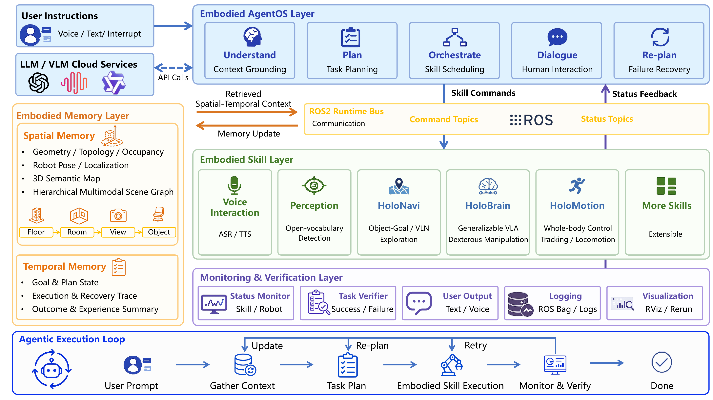

<div align="center">


[](https://horizonrobotics.github.io/robot_lab/holoagent/)
[](https://arxiv.org/abs/2606.23565)
[](https://huggingface.co/datasets/HorizonRobotics/fsrvln_datasets)
[](https://github.com/users/zhaoyu199201/packages/container/package/holoagent)
<!-- [](#release-status) -->
</div>

HoloAgent is a unified embodied-agent framework for general-purpose robots, integrating closed-loop execution, 3D spatial memory, and robot skills for real-world tasks.

## 🔥 News
- **[2026.12 (expected)]** HoloAgent-1 is expected by the end of the year.
- **[2026.06]** HoloAgent-0 is released. Code is under preparation and will be released soon.
- **[2025.09]** FSR-VLN is released for fast-and-slow vision-language navigation.

<!-- ## 🚀 HoloAgent-0
> ***HoloAgent-0*** connects Embodied AgentOS, 3D spatial memory, and embodied skills for real-world robot deployment.

It targets long-horizon navigation, object search, cross-robot coordination, mobile manipulation, and runtime-feedback-driven recovery. Code will be released in this repository after it is ready. -->

## ✅ Release Status
- [ ] HoloAgent-1 code update
  - [ ] HoloBrain for general-purpose dexterous manipulation
  - [ ] HoloMotion for whole-body mobile manipulation
  - [ ] Active exploration Agent-Loop
  - [ ] Vision-only autonomy for mapping, localization, navigation, and obstacle avoidance
- [x] HoloAgent-0 code update
  - [x] FSR-VLN semantic mapping acceleration with OVO-Mapping replacing HOV-SG
  - [x] Chatbot speech interaction upgraded with Doubao LLM
  - [x] AgentOS Harness adapted to OpenClaw
  - [x] Secure isolation for background processes and skill triggering via dimos-inspired Skill/Blueprint mechanisms with Harness
- [x] HoloAgent-0 project page & paper
- [x] FSR-VLN code

## 🧩 Components
- **Embodied AgentOS:** Coordinates high-level task planning, runtime feedback, and closed-loop robot execution.
- **3D Spatial Memory:** Grounds robot reasoning in physical-world spatial representations for long-horizon tasks.
- **Embodied Skills:** Connects agent decisions to executable robot navigation and manipulation skills.
- **FSR-VLN:** Provides fast-and-slow vision-language navigation with a hierarchical multi-modal scene graph.

## 🧠 Framework for Closed-Loop Robot Execution

AgentOS turns language instructions into monitored skill graphs and closes the loop across spatial retrieval, execution, memory updates, and recovery.



## 🤖 Real-Robot Demonstrations

Compressed previews from real-hardware deployments. Full-resolution videos are available on the project page.

| Navigation and Dance Coordination | Long-Horizon Mobile Manipulation |
|:---:|:---:|
|  |  |
| Coordinate navigation and humanoid motion across robots. | Decompose long-horizon manipulation into navigation, grasping, placement, and recovery. |

| Active Exploration in a New Environment | Interactive Humanoid Command Execution |
|:---:|:---:|
|  |  |
| Explore new spaces and update 3D memory online. | Follow open-ended commands with navigation and embodied actions. |

| A Day with a Robot Companion | A Day in the Life of a Robot Guide |
|:---:|:---:|
|  |  |
| Combine language, 3D reasoning, navigation, interaction, and action. | Guide users through workspaces with spatial-memory-aware routes. |

## 🤖 FSR-VLN
[](https://horizonrobotics.github.io/robot_lab/fsr-vln)
[](https://arxiv.org/abs/2509.13733)
[](https://mp.weixin.qq.com/s/HqnBlTNqOL3Z4Kg8tLHCSw)
> ***FSR-VLN*** is the HoloAgent navigation component, combining a Hierarchical Multi-modal Scene Graph with Fast-to-Slow Navigation Reasoning for efficient long-range spatial reasoning.


## 🏗 Getting Started

For system introduction, repository layout, dependency preparation, layered build instructions, runtime configuration, and deployment notes, refer to:

- [`docs/user_guide/Intruduction.md`](docs/user_guide/Intruduction.md)

This guide is the recommended starting point for setting up the current agentic robot system repository.

## 📚 Publications & Citation

If you find our project useful, please consider citing it:

```bibtex
@misc{holoagent2026holoagent0,
      title={HoloAgent-0: A Unified Embodied Agent Framework with 3D Spatial Memory},
      year={2026},
      eprint={2606.23565},
      archivePrefix={arXiv},
      primaryClass={cs.RO},
      url={https://arxiv.org/abs/2606.23565},
}
```

```bibtex
@misc{zhou2025fsrvlnfastslowreasoning,
      title={FSR-VLN: Fast and Slow Reasoning for Vision-Language Navigation with Hierarchical Multi-modal Scene Graph}, 
      author={Xiaolin Zhou and Tingyang Xiao and Liu Liu and Yucheng Wang and Maiyue Chen and Xinrui Meng and Xinjie Wang and Wei Feng and Wei Sui and Zhizhong Su},
      year={2025},
      eprint={2509.13733},
      archivePrefix={arXiv},
      primaryClass={cs.RO},
      url={https://arxiv.org/abs/2509.13733}, 
}
```

## 🙏 Acknowledgements

This project is built upon and inspired by several outstanding open source projects: [OVO](https://github.com/tberriel/OVO)、[HOV-SG](https://github.com/hovsg/HOV-SG)、[rerun](https://github.com/rerun-io/rerun)、[dimos](https://github.com/dimensionalOS/dimos.git)、[openclaw](https://github.com/openclaw/openclaw).

---

## ⚖️ License

This project is licensed under the [Apache License 2.0](LICENSE). See the `LICENSE` file for details.
