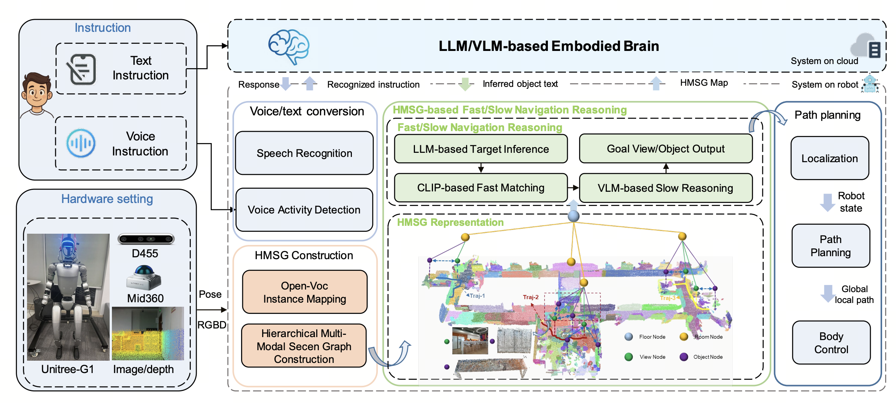

# FSR-VLN
[](https://horizonrobotics.github.io/robot_lab/fsr-vln)
[](https://arxiv.org/abs/2509.13733)
[](https://huggingface.co/datasets/HorizonRobotics/fsrvln_datasets)
[](https://github.com/users/zhaoyu199201/packages/container/package/holoagent)
[](https://mp.weixin.qq.com/s/HqnBlTNqOL3Z4Kg8tLHCSw)


This repository is the official implementation of the paper:

> **FSR-VLN: Fast and Slow Reasoning for Vision-Language Navigation with Hierarchical Multi-modal Scene Graph**





## 📔 Introduction
***FSR-VLN*** is a core component of the HoloAgent framework. It provides natural language guided navigation and intelligent interaction for general-purpose robots, and is built on core agent components such as mapping and localization, multimodal perception, decision-making and planning, and memory management. At its core, FSR-VLN is a vision–language navigation system that integrates a Hierarchical Multi-modal Scene Graph (HMSG) for coarse-to-fine environment representation with Fast-to-Slow Navigation Reasoning (FSR), leveraging VLM-driven refinement to enable efficient, real-time, long-range spatial reasoning.


## 🏗 Setup
Following instruction are for an Ubuntu>=20.04 system, with installed Conda and CUDA support.

Clone repository with recursive flag:

And set up the conda environment:
```bash
# conda env
conda env create -f environment.yaml
conda activate holoagent_semantic_mapping
```

```bash
# sam2 install
cd /path/segment-anything-2
pip install -e . --no-build-isolation
# If the torch version has been changed after installing sam2, please reinstall torch and torchvision
# pip install torch==2.5.0+cu121 torchvision==0.20.0+cu121 --extra-index-url https://download.pytorch.org/whl/cu121
```

```bash
# set up the hmsg python package
pip install -e .
```


## 🖼️ Dataset Preparation
FSR-VLN uses the G1 RGB-D sequences organized under the data root specified by `--data_dir` in `run_holoagent_mapping.py`.

### Data instructions
```text
${HOLOAGENT_DATA_ROOT}/VLN/instance_tracking/data/   (--data_dir)
├── input/
│   └── datasets/
│       └── G1/                                     (--dataset_name)
│           └── decoded_scans/
│               ├── sh_3f/                          (scene_name)
│               ├── ic_3f/
│               ├── ic_4f/
│               └── ic_7f/
└── output/
    └── G1/
        └── holoagent_mapping-g1/                   (--experiment_name)
            └── sh_3f/
```

`run_holoagent_mapping.py` reads scene data from:
```text
${HOLOAGENT_DATA_ROOT}/VLN/instance_tracking/data/input/datasets/G1/decoded_scans/<scene_name>
```

and writes mapping / HMSG results to:
```text
${HOLOAGENT_DATA_ROOT}/VLN/instance_tracking/data/output/G1/holoagent_mapping-g1/<scene_name>
```

### Data flow
```text
G1 RGB-D sequences
        │
        ▼
instance mapping
        │
        ▼
OVO output
        │
        ▼
hierarchical multi-modal scene graphs (HMSG)
        │
        ▼
visualization / graph query / navigation reasoning
```


## :rocket: Run
### Create hierarchical multi-modal scene graphs:
Use the maintained G1 entry script:
```bash
cd run_bash/
bash run_g1.sh
```

The current `run_g1.sh` launches `run_holoagent_mapping.py` with the following key arguments:
```bash
CUDA_VISIBLE_DEVICES=2,3,4,5,6,7 python run_holoagent_mapping.py \
 --data_dir ${HOLOAGENT_DATA_ROOT}/VLN/instance_tracking/data \
 --dataset_name G1 \
 --experiment_name holoagent_mapping-g1 \
 --scenes_list sh_3f \
 --build_hmsg \
 --run \
 --hmsg_config_path ${HOLOAGENT_DATA_ROOT}/VLN/instance_tracking/holoagent_mapping/mapvln/ovo_slam/configs/hmsg_bridge_sh3f.yaml \
 --cfg_path ${HOLOAGENT_DATA_ROOT}/VLN/instance_tracking/holoagent_mapping/mapvln/ovo_slam/configs/ovo_g1_sh3f.yaml
```

This stage runs instance mapping first and then builds the HMSG scene graph for each scene listed in `--scenes_list`. For the default script, the input scene is `sh_3f`, and the output will be saved under:
```text
${HOLOAGENT_DATA_ROOT}/VLN/instance_tracking/data/output/G1/holoagent_mapping-g1/sh_3f
```

### Visualize and query scene graph
```bash
python visualize_scene.py \
  --working_dir ${HOLOAGENT_DATA_ROOT}/VLN/instance_tracking/holoagent_mapping/mapvln/ovo_slam \
  --run_path data/output/G1/holoagent_mapping-g1/sh_3f \
  --visualize_obj
```

The visualization stage reads the generated graph files from the mapping output directory and renders the scene graph for inspection.